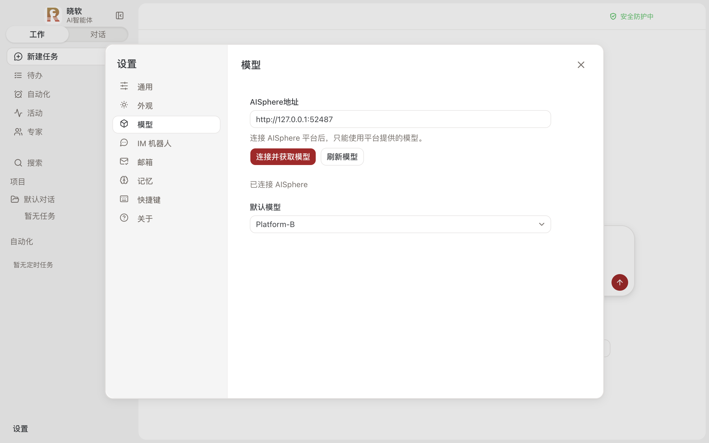
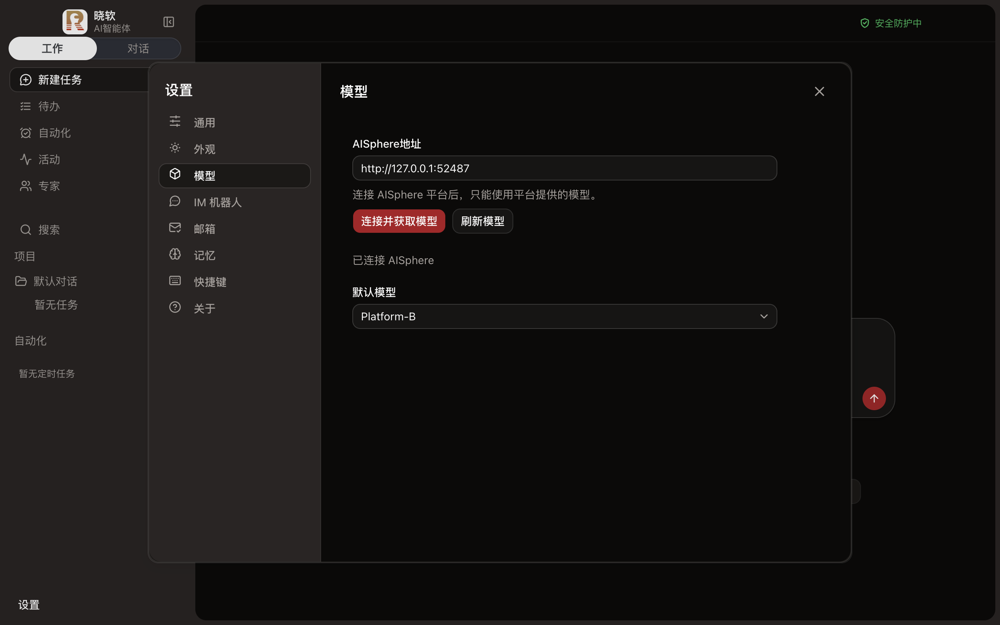
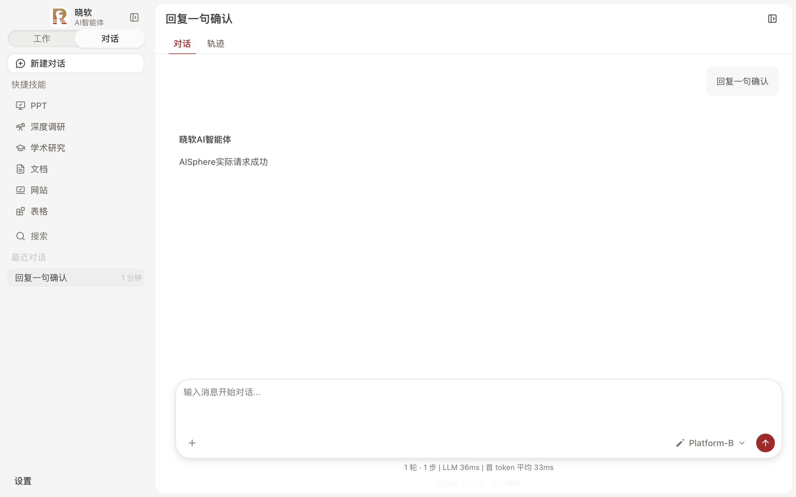

# AISphere validation

The custom edition only accepts models discovered from the bound AISphere service. Verification uses a local fixture with the supplied discovery and model-list shapes; the customer's deployment network was unreachable from the development host.

## Evidence

- Electron production build with isolated user data: invalid address feedback, discovery, model selection, light/dark appearance and a real streaming chat through the main-process gateway passed with no renderer page errors.
- The fixture observed the selected model's exact inference URL and its own bearer key. A catalog `tool_call: false` did not prevent an actual chat request with tools.
- Main-process tests cover platform identity, model validation, default and explicit agent routing, per-model credentials and endpoints, rejection of external providers and missing models, refresh failure, refresh deduplication, binding-switch races, active-request exclusion, credential rotation and output limits.
- Native HTTP/HTTPS tests cover plaintext HTTP, self-signed certificate continuation and rejection of redirects. A normal global fetch still rejects the self-signed certificate.
- The request-body worker is exercised as a real Node worker, with malformed, oversized and cancelled requests. No platform keys or endpoints cross the worker boundary. Lifecycle, credentials, stream ordering and configuration writes remain in the main process.
- Local worker comparison: 20 sequential requests, 8,388,688 bytes each, including JSON parsing and output-limit serialization. Main-thread baseline: 109 ms total, 107 ms maximum timer lag; worker: 138 ms total, 2 ms maximum timer lag. This measures responsiveness, not higher throughput, and is a single-host observation rather than a CI performance threshold.
- Regression tests, renderer/main TypeScript checks, lint and production build passed. The workflow includes AISphere, native transport, agent routing and model-selection tests.

## Screenshots

## Contract boundaries

`name` is used as the request model ID. Zero input/output limits mean unspecified; positive output limits are enforced by the gateway, while the platform enforces tokenized input limits. Unknown tool templates are not executed. HTTP and certificate-invalid HTTPS are intentionally supported only for bound-platform discovery and catalog-provided endpoints. External scripts and user-supplied MCP servers are outside the built-in model-routing restriction.

Windows installation and customer-platform network tests have not been repeated for this source change. Packaging and public R2 publication remain separate manual workflows.
